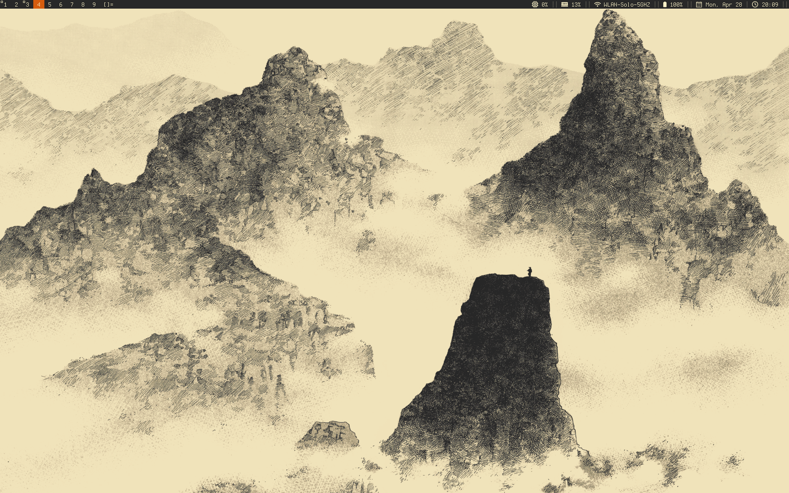
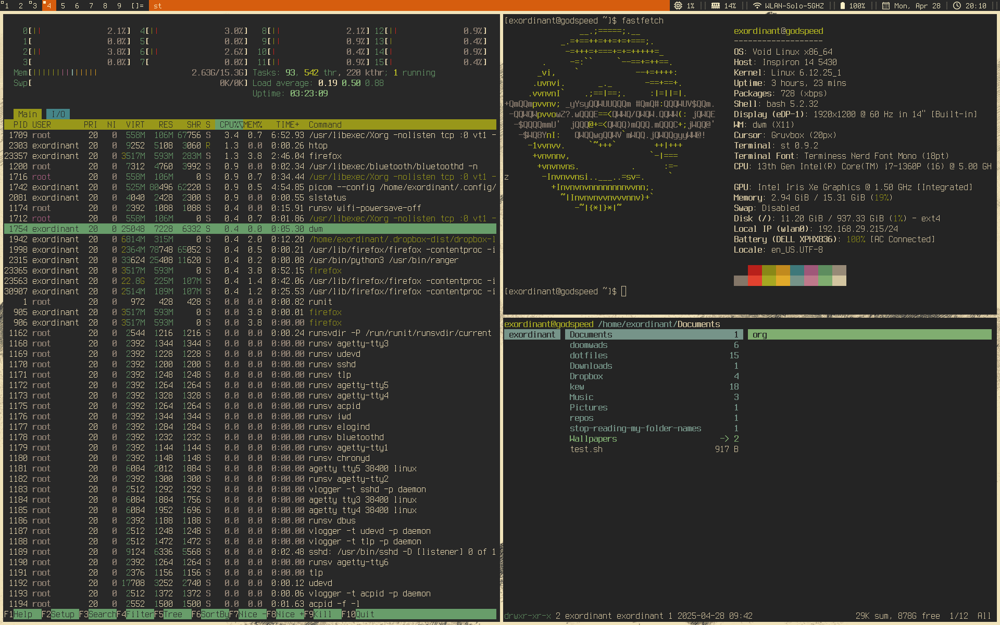

# Dotfiles

Tested on Void Linux (glibc).

## READ THIS

I recommend that you don't use my configs as they are not well documented. This repo is only for my convenience and as such will only be maintained to keep it working on **my** system.

## Prerequisites

To get started, you'll need to clone the repository and install the required packages using the included script.

```bash
# Clone the repository
git clone https://github.com/soothsayerwally/dotfiles.git

# Change into the scripts directory
cd dotfiles/scripts

# Run the install script with sudo to install required packages (plus a few things that I need, feel free to edit those out)
sudo ./install_packages.sh

```

## Symlinking

We'll use GNU Stow to symlink everything to the right place, Stow should be already installed if you ran the install-packages script.

```bash
# Change into the dotfiles directory
cd dotfiles

# Run stow
stow .
```

## Installing Suckless Utilities

```bash
# Navigate to the suckless directory
cd dotfiles/.config/suckless

# Navigate to the individual app directories (eg: dmenu) and install
cd dmenu
sudo make clean install
```


## How it looks





